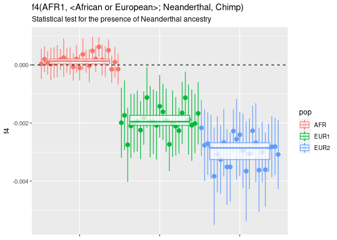
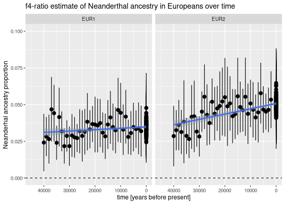

Load the *slendr* library (we use a development version from GitHub, so
we’re loading it from a local copy):

``` r
devtools::load_all("~/projects/slendr")
#> ℹ Loading slendr
```

Set the location for the model configuration files and the direction for
output data:

``` r
model_dir <- "~/projects/introgression-sims/model"
output_dir <- "~/projects/introgression-sims/results"
```

Let’s specify the simplest possible introgression model with only three
populations:

-   one African population with *N*<sub>*e*</sub> = 10000 (persisting
    from 650 kya to the present)
-   one Neanderthal population with *N*<sub>*e*</sub> = 1000 (becomes
    extinct at 40 kya)
-   one “European” population – no complex Eurasian history, a single
    uniform population with *N*<sub>*e*</sub> = 5000

``` r
afr <- population("AFR", time = 650e3, N = 10000)
nea <- population("NEA", parent = afr, time = 600e3, N = 1000, remove = 40e3)
eur <- population("EUR", parent = afr, time = 70e3, N = 5000)
```

Neanderthal introgression into Europeans between 55-50 kya at 3%:

``` r
gf <- geneflow(from = nea, to = eur, rate = 0.03, start = 55000, end = 50000)
```

Compile the *slendr* model to a set configuration files which will be
loaded by the SLiM backend script below:

``` r
model <- compile(
  populations = list(nea, afr, eur), geneflow = gf,
  generation_time = 30,
  dir = model_dir, overwrite = TRUE
)
```

Define a couple of individuals that will be “sampled” (i.e. explicitly
remembered in the tree sequence with their complete genetic sequence):

-   we will sample one Neanderthal 70 kya old (approximating the
    high-coverage “Altai” Neanderthal genome) and another one 40 ky old
    (approximating the high-coverage Neanderthal from the Vindija cave)
-   300 present-day Africans, 100 present-day Europeans
-   a time-series of early-modern Europeans sampled between 40000 and
    3000 kya, one every 1000 years

``` r
nea_samples <- sampling(model, times = c(70000, 40000), list(nea, 1))
present_samples <- sampling(model, times = 0, list(afr, 300), list(eur, 100))
emh_samples <- sampling(model, times = seq(40000, 3000, by = -1000), list(eur, 1))

samples <- rbind(nea_samples, present_samples, emh_samples)
```

Finally we execute the simulation (we simulate 100Mb of sequence in each
sampled individual, with the recombination rate 10<sup> − 8</sup> per bp
per generation):

``` r
slim(
  model, seq_length = 100e6, recomb_rate = 1e-8,
  ts_recording = TRUE, sampling = samples,
  method = "batch", output_dir = output_dir,
  overwrite = TRUE, verbose = TRUE, seed = 314159265
)
```

Let’s load the tree sequence generated by SLiM under the hood,
[recapitate](https://pyslim.readthedocs.io/en/latest/tutorial.html#recapitation)
it to ensure coalescence of all genealogies in the tree sequence,
[simplify](https://pyslim.readthedocs.io/en/latest/tutorial.html#simplification)
it to only nodes appearing as coalescence nodes somewhere in the
genealogy of the explicitly sampled individuals (or rather their
chromosomes):

``` r
ts <- ts_load(model, output_dir = output_dir,
              recapitate = TRUE, Ne = 10000, recomb_rate = 1e-8,
              simplify = TRUE)

ts
#> ╔═══════════════════════════╗
#> ║TreeSequence               ║
#> ╠═══════════════╤═══════════╣
#> ║Trees          │     390099║
#> ╟───────────────┼───────────╢
#> ║Sequence Length│100000000.0║
#> ╟───────────────┼───────────╢
#> ║Sample Nodes   │        880║
#> ╟───────────────┼───────────╢
#> ║Total Size     │   68.9 MiB║
#> ╚═══════════════╧═══════════╝
#> ╔═══════════╤═══════╤════════╤════════════╗
#> ║Table      │Rows   │Size    │Has Metadata║
#> ╠═══════════╪═══════╪════════╪════════════╣
#> ║Edges      │1466305│39.2 MiB│          No║
#> ╟───────────┼───────┼────────┼────────────╢
#> ║Individuals│ 188109│11.5 MiB│         Yes║
#> ╟───────────┼───────┼────────┼────────────╢
#> ║Migrations │      0│ 4 Bytes│          No║
#> ╟───────────┼───────┼────────┼────────────╢
#> ║Mutations  │      0│ 1.2 KiB│          No║
#> ╟───────────┼───────┼────────┼────────────╢
#> ║Nodes      │ 228679│ 7.0 MiB│         Yes║
#> ╟───────────┼───────┼────────┼────────────╢
#> ║Populations│      3│ 2.9 KiB│         Yes║
#> ╟───────────┼───────┼────────┼────────────╢
#> ║Provenances│      3│31.5 KiB│          No║
#> ╟───────────┼───────┼────────┼────────────╢
#> ║Sites      │      0│ 8 Bytes│          No║
#> ╚═══════════╧═══════╧════════╧════════════╝
```

Let’s sprinkle mutations on the tree sequence data structure (not that
we did not simulate any mutations at all so far, which is why we can
generate so much data for so many individuals in a forward simulation):

``` r
ts_mut <- ts_mutate(ts, mutation_rate = 1e-8)

ts_mut
#> ╔═══════════════════════════╗
#> ║TreeSequence               ║
#> ╠═══════════════╤═══════════╣
#> ║Trees          │     390099║
#> ╟───────────────┼───────────╢
#> ║Sequence Length│100000000.0║
#> ╟───────────────┼───────────╢
#> ║Sample Nodes   │        880║
#> ╟───────────────┼───────────╢
#> ║Total Size     │   88.1 MiB║
#> ╚═══════════════╧═══════════╝
#> ╔═══════════╤═══════╤════════╤════════════╗
#> ║Table      │Rows   │Size    │Has Metadata║
#> ╠═══════════╪═══════╪════════╪════════════╣
#> ║Edges      │1466305│39.2 MiB│          No║
#> ╟───────────┼───────┼────────┼────────────╢
#> ║Individuals│ 188109│11.5 MiB│         Yes║
#> ╟───────────┼───────┼────────┼────────────╢
#> ║Migrations │      0│ 4 Bytes│          No║
#> ╟───────────┼───────┼────────┼────────────╢
#> ║Mutations  │ 438115│12.1 MiB│          No║
#> ╟───────────┼───────┼────────┼────────────╢
#> ║Nodes      │ 228679│ 7.0 MiB│         Yes║
#> ╟───────────┼───────┼────────┼────────────╢
#> ║Populations│      3│ 2.9 KiB│         Yes║
#> ╟───────────┼───────┼────────┼────────────╢
#> ║Provenances│      4│32.3 KiB│          No║
#> ╟───────────┼───────┼────────┼────────────╢
#> ║Sites      │ 438115│ 7.1 MiB│          No║
#> ╚═══════════╧═══════╧════════╧════════════╝
```

## Sanity checks

First, let’s check the contents of the tree sequence tables to make sure
we have all the samples we simulated:

``` r
ts_data(ts_mut)
#> slendr 'tsdata' object 
#> ---------------------- 
#> tree-sequence contents:
#>   AFR - 300 sampled, 136779 retained individuals
#>   NEA - 2 sampled, 4711 retained individuals
#>   EUR - 138 sampled, 46179 retained individuals
#> 
#> total: 440 sampled, 187669 retained individuals and
#>  no nodes from an unassigned individual 
#> 
#> oldest sampled individual: 70000 backward time units
#> youngest sampled individual: 0 backward time units
#> 
#> oldest node: 8148036 backward time units
#> youngest node: 0 backward time units
#> ---------------------- 
#> data was generated by a non-spatial slendr model
```

Then, just for fun, let’s save the data as an EIGENSTRAT format used by
ADMIXTOOLS. Here we are creating data with an added artificial outgroup
“Chimp” (note that we didn’t explicitly simulate chimpanzee lineage to
save some time during simulation). This sample will have all ancestral
alleles.

This command can take unfortunately quite long and takes quite a bit of
memory, because we are extracting a matrix of all genotypes in the tree
sequence and muging it a bit in R to be EIGENSTRAT compliant. This is
very inefficient and will need some reimplementing to make it scalable…
But it works.

``` r
prefix <- file.path(output_dir, "eigenstrat")

eigen_data <- ts_eigenstrat(ts_mut, prefix = prefix, outgroup = "chimp")
#> 953 mutations (out of 438115) have been removed because they appeared on a position already occupied by another mutation. This is a consequence of mutations positions in tskit being in floating-point values but normal genomic locations being integer values.
```

Let’s load [admixr](https://bodkan.net/admixr) (plus dplyr and ggplo2
for table munging and plotting) and do some quick sanity checks.

``` r
library(admixr)
library(dplyr)
#> 
#> Attaching package: 'dplyr'
#> The following object is masked from 'package:testthat':
#> 
#>     matches
#> The following objects are masked from 'package:stats':
#> 
#>     filter, lag
#> The following objects are masked from 'package:base':
#> 
#>     intersect, setdiff, setequal, union
library(ggplot2)
```

Let’s also extract the names (and ages) of all sampled individualsL

``` r
samples <- ts_samples(ts)
```

First,
$f4(\\textrm{African}\_i, \\textrm{African}\_j}, \\textrm{Neanderthal}, \\textrm{chimp})$
should be zero (no introgression into any African) but
$f4(\\textrm{African}\_i, \\textrm{European}\_j}, \\textrm{Neanderthal}, \\textrm{chimp})$
should be significantly negative because of the genetic affinity between
Neanderthals and Europeans (we do this only for a subset of present-day
individuals to reduce computational time and memory):

``` r
f4_result <-
  filter(samples, time == 0, pop %in% c("AFR", "EUR")) %>%
  group_by(pop) %>%
  sample_n(20) %>%
  pull(name) %>%
  f4(W = "AFR1", X = ., Y = "NEA1", Z = "chimp", data = eigen_data)
```

``` r
inner_join(f4_result, samples, by = c("X" = "name")) %>%
  ggplot(aes(pop, f4, color = pop)) +
    geom_pointrange(aes(ymin = f4 - 2 * stderr, ymax = f4 + 2 * stderr, group = X),
                    position = position_dodge(width = 1)) +
    geom_hline(yintercept = 0, linetype = 2) +
    theme(axis.text.x = element_blank(), axis.title.x = element_blank())
```



Looks great! We can see that the Africans are all consistent with the
hypothesis of no Neanderthal introgression (as expected, and as implied
by the *f*<sub>4</sub> values consistent with 0). On the other hand, we
get a significantly negative *f*<sub>4</sub> value for all European
individuals, indicating that they carry evidence of Neanderthal
introgression.

Let’s see how much Neanderthal ancestry we detect in Europeans (this is,
of course, a different question than *if* we detect it). First let’s use
the `f4ratio` function in the *admixr* R package to perform the
*f*<sub>4</sub>-ratio estimate of Neanderhal ancestry:

``` r
f4ratio_result <-
  filter(samples, pop == "EUR") %>%
  pull(name) %>%
  f4ratio(X = ., A = "NEA1", B = "NEA2", C = "AFR1", O = "chimp", data = eigen_data)
```

Now let’s plot the time-series of Neanderthal ancestry estimates in
simulated Europeans over time:

``` r
inner_join(f4ratio_result, samples, by = c("X" = "name")) %>%
  ggplot(aes(time, alpha)) +
    geom_pointrange(aes(ymin = alpha - 2 * stderr, ymax = alpha + 2 * stderr)) +
    geom_hline(yintercept = 0, linetype = 2) +
    geom_smooth(method = "lm") +
    coord_cartesian(ylim = c(0, 0.1)) +
    xlim(c(max(filter(samples, pop == "EUR")$time), 0))
#> `geom_smooth()` using formula 'y ~ x'
```



As expected, we see a constant level of Neanderthal ancestry around 3%
(which is exactly what we have simulated)!

## VCF output

Having made sure that the simulated data looks reasonable, we can save
the simulated genotypes in a VCF format:

``` r
ts_vcf(ts_mut, path = file.path(output_dir, "output.vcf.gz"))
```
