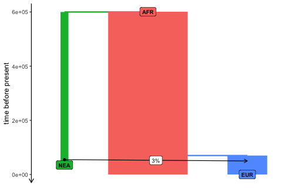
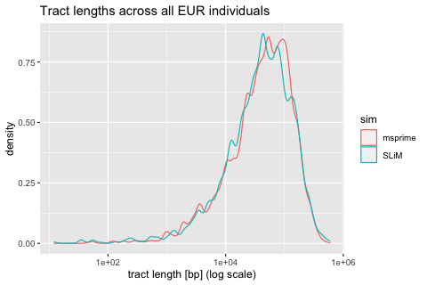
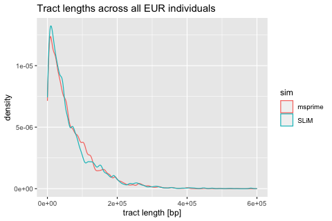
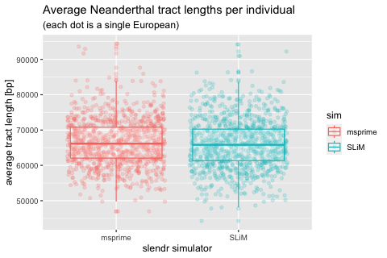

# Simulating Neanderthal introgression data using *slendr*

Let’s start by loading the *slendr* library (we install a development
version from GitHub):

``` r
devtools::install_github("bodkan/slendr")
#> Using github PAT from envvar GITHUB_PAT
#> Skipping install of 'slendr' from a github remote, the SHA1 (23bc1dd1) has not changed since last install.
#>   Use `force = TRUE` to force installation
```

``` r
library(ggplot2)
library(dplyr)
#> 
#> Attaching package: 'dplyr'
#> The following objects are masked from 'package:stats':
#> 
#>     filter, lag
#> The following objects are masked from 'package:base':
#> 
#>     intersect, setdiff, setequal, union

library(slendr)
#> The legacy packages maptools, rgdal, and rgeos, underpinning the sp package,
#> which was just loaded, will retire in October 2023.
#> Please refer to R-spatial evolution reports for details, especially
#> https://r-spatial.org/r/2023/05/15/evolution4.html.
#> It may be desirable to make the sf package available;
#> package maintainers should consider adding sf to Suggests:.
#> The sp package is now running under evolution status 2
#>      (status 2 uses the sf package in place of rgdal)
init_env()
#> The interface to all required Python modules has been activated.

SEED <- 314159265
set.seed(SEED)

output_dir <- "./results"
```

Set the location for model configuration files and the output data
directory:

Let’s specify the simplest possible introgression model with only three
populations:

- one African population with $N_e = 10000$ (persisting from 650 kya to
  the present)
- one Neanderthal population with $N_e = 1000$ (becomes extinct at 40
  kya)
- one “European” population – no complex Eurasian history, a single
  uniform population with $N_e = 5000$

``` r
afr <- population("AFR", time = 601e3, N = 10000)
nea <- population("NEA", time = 600e3, parent = afr, N = 1000, remove = 35e3)
eur <- population("EUR", parent = afr, time = 70e3, N = 5000)
```

Neanderthal introgression into Europeans between 55-50 kya at 3%:

``` r
gf <- gene_flow(from = nea, to = eur, rate = 0.03, start = 55000, end = 50000)
```

Compile the *slendr* model to a set configuration files which will be
loaded by the SLiM backend script below:

``` r
model <- compile_model(
  populations = list(nea, afr, eur), gene_flow = gf,
  generation_time = 30
)
```

``` r
plot_model(model, proportions = TRUE)
```

<!-- -->

Define a couple of individuals that will be “sampled” (i.e. explicitly
remembered in the tree sequence with their complete genetic sequence):

- we will sample one Neanderthal 70 kya old (approximating the
  high-coverage “Altai” Neanderthal genome) and another one 40 ky old
  (approximating the high-coverage Neanderthal from the Vindija cave)
- 10 present-day Africans, 500 present-day Europeans

``` r
nea_samples <- schedule_sampling(model, times = c(70000, 40000), list(nea, 1))
present_samples <- schedule_sampling(model, times = 0, list(afr, 10), list(eur, 500))

samples <- rbind(nea_samples, present_samples)
```

Finally we execute the simulation (we simulate 200Mb of sequence in each
sampled individual, with the recombination rate $10^{-8}$ per bp per
generation):

``` r
ts_msprime <- msprime(
  model, sequence_length = 200e6, recombination_rate = 1e-8,
  samples = samples, output = file.path(output_dir, "output_ts_msprime.trees"),
  random_seed = SEED
)
```

## Loading and processing the tree sequence output

Let’s load the tree sequence generated by SLiM under the hood,
[recapitate](https://pyslim.readthedocs.io/en/latest/tutorial.html#recapitation)
it to ensure coalescence of all genealogies in the tree sequence, and
[simplify](https://pyslim.readthedocs.io/en/latest/tutorial.html#simplification)
it to only nodes appearing as coalescence nodes somewhere in the
genealogy of the explicitly sampled individuals (or rather their
chromosomes). At the same time, let’s also sprinkle mutations on the
tree sequence data structure (note that we did not simulate any
mutations at all so far, which is why we can generate so much data for
so many individuals in a forward simulation):

## Compute the tracts (the new way)

``` r
tracts_slim <- readr::read_tsv("results/tracts_slim.tsv") %>%
  mutate(length = end - start, sim = "SLiM") %>%
  rename(node = slim_id) %>%
  select(node, length, sim)
#> Rows: 85853 Columns: 3
#> ── Column specification ────────────────────────────────────────────────────────
#> Delimiter: "\t"
#> dbl (3): start, end, slim_id
#> 
#> ℹ Use `spec()` to retrieve the full column specification for this data.
#> ℹ Specify the column types or set `show_col_types = FALSE` to quiet this message.
```

``` r
tracts_msprime <- ts_tracts(ts_msprime, census = 55000, source = "NEA") %>% 
  rename(node = node_id) %>%
  mutate(sim = "msprime") %>%
  select(node, length, sim)
#> 
#> PopAncestry summary
#> Number of ancestral populations:     3
#> Number of sample chromosomes:        1024
#> Number of ancestors:             121545
#> Total length of genomes:         204800000000.000000
#> Ancestral coverage:          204400000000.000000
```

``` r
tracts <- rbind(tracts_slim, tracts_msprime)
```

``` r
ggplot(tracts) +
  geom_density(aes(length, color = sim)) +
  scale_x_log10() +
  xlab("tract length [bp] (log scale)") +
  ggtitle("Tract lengths across all EUR individuals")
```

<!-- -->

``` r
ggplot(tracts) +
  geom_density(aes(length, color = sim)) +
  xlab("tract length [bp]") +
  ggtitle("Tract lengths across all EUR individuals")
```

<!-- -->

``` r
means <- tracts %>% group_by(node, sim) %>% summarise(mean = mean(length))
#> `summarise()` has grouped output by 'node'. You can override using the
#> `.groups` argument.
```

``` r
group_by(means, sim) %>% summarise(mean(mean))
#> # A tibble: 2 × 2
#>   sim     `mean(mean)`
#>   <chr>          <dbl>
#> 1 SLiM          65979.
#> 2 msprime       66438.
```

``` r
ggplot(means, aes(sim, mean, color = sim)) +
  geom_jitter(alpha = 0.2) +
  geom_boxplot(alpha = 0.2) +
  xlab("slendr simulator") + ylab("average tract length [bp]") +
  ggtitle("Average Neanderthal tract lengths per individual",
          "(each dot is a single European)")
```

<!-- -->
