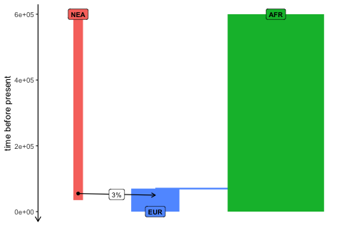

# Simulating Neanderthal introgression data using *slendr*

Let’s start by loading the *slendr* library (we install a development
version from GitHub):

``` r
devtools::install_github("bodkan/slendr")
#> Using github PAT from envvar GITHUB_PAT
#> Skipping install of 'slendr' from a github remote, the SHA1 (23bc1dd1) has not changed since last install.
#>   Use `force = TRUE` to force installation
```

``` r
library(dplyr)
#> 
#> Attaching package: 'dplyr'
#> The following objects are masked from 'package:stats':
#> 
#>     filter, lag
#> The following objects are masked from 'package:base':
#> 
#>     intersect, setdiff, setequal, union

library(slendr)
#> The legacy packages maptools, rgdal, and rgeos, underpinning the sp package,
#> which was just loaded, will retire in October 2023.
#> Please refer to R-spatial evolution reports for details, especially
#> https://r-spatial.org/r/2023/05/15/evolution4.html.
#> It may be desirable to make the sf package available;
#> package maintainers should consider adding sf to Suggests:.
#> The sp package is now running under evolution status 2
#>      (status 2 uses the sf package in place of rgdal)
init_env()
#> The interface to all required Python modules has been activated.

SEED <- 314159265
set.seed(SEED)
```

Set the location for model configuration files and the output data
directory:

``` r
model_dir <- "./model"
output_dir <- "./results"

if (!dir.exists(output_dir)) dir.create(output_dir)
```

Let’s specify the simplest possible introgression model with only three
populations:

- one African population with $N_e = 10000$ (persisting from 650 kya to
  the present)
- one Neanderthal population with $N_e = 1000$ (becomes extinct at 40
  kya)
- one “European” population – no complex Eurasian history, a single
  uniform population with $N_e = 5000$

``` r
afr <- population("AFR", time = 600e3, N = 10000)
nea <- population("NEA", time = 600e3, N = 1000, remove = 35e3)
eur <- population("EUR", parent = afr, time = 70e3, N = 5000)
```

Neanderthal introgression into Europeans between 55-50 kya at 3%:

``` r
gf <- gene_flow(from = nea, to = eur, rate = 0.03, start = 55000, end = 50000)
```

Compile the *slendr* model to a set configuration files which will be
loaded by the SLiM backend script below:

``` r
model <- compile_model(
  populations = list(nea, afr, eur), gene_flow = gf,
  generation_time = 30,
  path = model_dir, overwrite = TRUE, force = TRUE
)
```

``` r
plot_model(model, proportions = TRUE)
```

<!-- -->

Define a couple of individuals that will be “sampled” (i.e. explicitly
remembered in the tree sequence with their complete genetic sequence):

- we will sample one Neanderthal 70 kya old (approximating the
  high-coverage “Altai” Neanderthal genome) and another one 40 ky old
  (approximating the high-coverage Neanderthal from the Vindija cave)
- 10 present-day Africans, 500 present-day Europeans

``` r
nea_samples <- schedule_sampling(model, times = c(70000, 40000), list(nea, 1))
present_samples <- schedule_sampling(model, times = 0, list(afr, 10), list(eur, 500))

samples <- rbind(nea_samples, present_samples)
```

Finally we execute the simulation (we simulate 200Mb of sequence in each
sampled individual, with the recombination rate $10^{-8}$ per bp per
generation):

``` r
ts <- slim(
  model, sequence_length = 200e6, recombination_rate = 1e-8,
  samples = samples, method = "batch", output = file.path(output_dir, "output_ts_slim.trees"),
  verbose = TRUE, random_seed = SEED
)
```

``` r
model <- read_model("model")

ts <- ts_load("./results/output_ts_slim.trees", model = model) %>%
  ts_recapitate(recombination_rate = 1e-8, Ne = 10000) %>%
  ts_mutate(1e-8)
```

## Save numeric identifiers of chromosomes for tree sequence processing

As can be seen from this notebook, thanks to the *slendr* interface, we
can refer to individuals (and their populations) with easy to read
string names. However, the Jupyter notebook describing detection of true
Neanderthal fragments in simulated tree sequences
(`detect_tracts.ipynb`) is implemented in Python using native tskit
Python interface which lacks this functionality. In the following chunk,
we will save a table of individual names together with the unique
numerical IDs of their chromosomes in the tree sequence. We will use
this table in that Jupyter notebook for assigning detected tracts to the
correct individuals:

``` r
node_table <-
  ts_nodes(ts) %>%
  filter(remembered, pop == "EUR") %>%
  as_tibble() %>%
  mutate(slim_id = purrr::map_int(node_id, ~ ts$node(as.integer(.x))$metadata["slim_id"][[1]])) %>%
  select(name, pop, time, slim_id)

readr::write_tsv(node_table, "results/nodes.tsv")
```

## VCF output

Having made sure that the simulated data looks reasonable, we can save
the simulated genotypes in a VCF format:

``` r
ts_vcf(ts, path = file.path(output_dir, "output.vcf.gz"))
```

## How to run this pipeline

Of course, individual chunks can be run in an R console. The entire
RMarkdown notebook can be rendered (simulations will be run, output
files will be generated, and figures will be plotted) by typing
`R -e 'rmarkdown::render("introgression.Rmd")'`.

## Compute the tracts (the old way)

    /Users/mp/Library/r-miniconda-arm64/envs/Python-3.11_msprime-1.2.0_tskit-0.5.6_pyslim-1.0.4_tspop-0.0.2/bin/python detect_tracts.py --slendr model --trees results/output_ts_slim.trees --output results/tracts_slim.tsv
