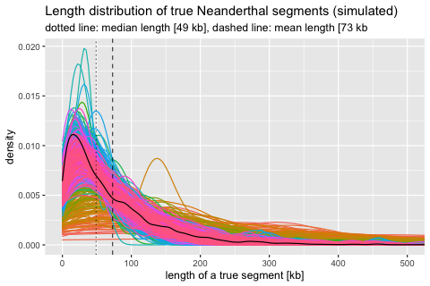
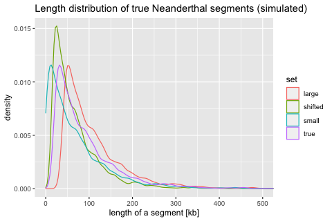
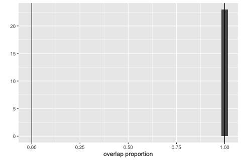
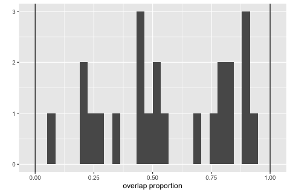
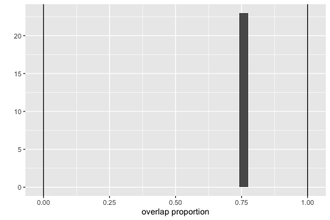

# Analysing the overlap between true and estimated segments

I like to use the package
p_GenomicRanges\_\](<https://bioconductor.org/packages/release/bioc/vignettes/GenomicRanges/inst/doc/GenomicRangesIntroduction.html>)
from Bioconductor for this type of analysis (checking overlaps between
ranges, proportions of overlaps, etc.).

``` r
# install.packages("BiocManager")
# BiocManager::install("GenomicRanges")

library(GenomicRanges)
#> Warning: package 'GenomicRanges' was built under R version 4.1.1
#> Loading required package: stats4
#> Loading required package: BiocGenerics
#> Warning: package 'BiocGenerics' was built under R version 4.1.1
#> 
#> Attaching package: 'BiocGenerics'
#> The following objects are masked from 'package:stats':
#> 
#>     IQR, mad, sd, var, xtabs
#> The following objects are masked from 'package:base':
#> 
#>     anyDuplicated, append, as.data.frame, basename, cbind, colnames,
#>     dirname, do.call, duplicated, eval, evalq, Filter, Find, get, grep,
#>     grepl, intersect, is.unsorted, lapply, Map, mapply, match, mget,
#>     order, paste, pmax, pmax.int, pmin, pmin.int, Position, rank,
#>     rbind, Reduce, rownames, sapply, setdiff, sort, table, tapply,
#>     union, unique, unsplit, which.max, which.min
#> Loading required package: S4Vectors
#> Warning: package 'S4Vectors' was built under R version 4.1.1
#> 
#> Attaching package: 'S4Vectors'
#> The following objects are masked from 'package:base':
#> 
#>     expand.grid, I, unname
#> Loading required package: IRanges
#> Warning: package 'IRanges' was built under R version 4.1.1
#> Loading required package: GenomeInfoDb
#> Warning: package 'GenomeInfoDb' was built under R version 4.1.1
library(tidyverse)
#> ── Attaching packages ───────────────────────────────────────────────────────── tidyverse 1.3.1 ──
#> ✓ ggplot2 3.3.5     ✓ purrr   0.3.4
#> ✓ tibble  3.1.4     ✓ dplyr   1.0.7
#> ✓ tidyr   1.1.3     ✓ stringr 1.4.0
#> ✓ readr   2.0.2     ✓ forcats 0.5.1
#> ── Conflicts ──────────────────────────────────────────────────────────── tidyverse_conflicts() ──
#> x dplyr::collapse()   masks IRanges::collapse()
#> x dplyr::combine()    masks BiocGenerics::combine()
#> x dplyr::desc()       masks IRanges::desc()
#> x tidyr::expand()     masks S4Vectors::expand()
#> x dplyr::filter()     masks stats::filter()
#> x dplyr::first()      masks S4Vectors::first()
#> x dplyr::lag()        masks stats::lag()
#> x ggplot2::Position() masks BiocGenerics::Position(), base::Position()
#> x purrr::reduce()     masks GenomicRanges::reduce(), IRanges::reduce()
#> x dplyr::rename()     masks S4Vectors::rename()
#> x dplyr::slice()      masks IRanges::slice()
library(glue)
#> 
#> Attaching package: 'glue'
#> The following object is masked from 'package:dplyr':
#> 
#>     collapse
#> The following object is masked from 'package:GenomicRanges':
#> 
#>     trim
#> The following objects are masked from 'package:IRanges':
#> 
#>     collapse, trim
```

Load the true segments:

``` r
true_segments <-
  read_tsv("~/Cluster/introgression-sims/results/tracts.tsv.gz",
           show_col_types = FALSE) %>%
  mutate(chrom = "chr1") %>%
  makeGRangesFromDataFrame(keep.extra.columns = TRUE)
```

Get a basic summary of the data:

``` r
summary(width(true_segments))
#>    Min. 1st Qu.  Median    Mean 3rd Qu.    Max. 
#>      18   20764   48905   72782   98569 1599283
```

``` r
as_tibble(true_segments) %>%
  ggplot() +
  geom_density(aes(width / 1e3, color = factor(slim_id)), alpha = 0.5) +
  geom_density(aes(width / 1e3)) +
  geom_vline(xintercept = mean(width(true_segments) / 1e3), linetype = 2, alpha = 0.75) +
  geom_vline(xintercept = median(width(true_segments) / 1e3), linetype = 3, alpha = 0.75) +
  guides(color = "none") +
  xlab("length of a true segment [kb]") +
  coord_cartesian(xlim = c(0, 500)) +
  ggtitle("Length distribution of true Neanderthal segments (simulated)",
          glue("dotted line: median length [{format(median(width(true_segments) / 1e3),",
               "digits = 1)} kb], dashed line: mean length [{format(mean(width(true_segments) / 1e3), digits = 2)} kb"))
```

<!-- -->

Create fake “estimated” date by messing up the known true segments (in
practice these would be the fragments estimated by the software):

``` r
filtered_segments <- true_segments[width(true_segments) > 20e3]
filtered_segments$set <- "true"

# create fake segments which extend by 10kb on both ends of the true segments
est_segments_large <- filtered_segments
start(est_segments_large) <- start(est_segments_large) - 10000
end(est_segments_large) <- end(est_segments_large) + 10000
est_segments_large$set <- "large"

# create fake segments which are 10kb shorter on both ends of the true segments
est_segments_small <- filtered_segments
start(est_segments_small) <- start(est_segments_small) + 10000
end(est_segments_small) <- end(est_segments_small) - 10000
est_segments_small$set <- "small"

# create fake segments which are shifted by 25% of the length
est_segments_shifted <- filtered_segments
start(est_segments_shifted) <- start(est_segments_shifted) + width(est_segments_shifted) / 4
est_segments_shifted$set <- "shifted"
```

``` r
# plot the overall distributions of all three sets of segments

segments <- rbind(
  as_tibble(filtered_segments),
  as_tibble(est_segments_large),
  as_tibble(est_segments_small),
  as_tibble(est_segments_shifted)
)

segments %>%
  ggplot() +
  geom_density(aes(width / 1e3, color = set), alpha = 0.5) +
  xlab("length of a segment [kb]") +
  coord_cartesian(xlim = c(0, 500)) +
  ggtitle("Length distribution of true Neanderthal segments (simulated)")
```

<!-- -->

Now let’s try to “analyse” the overlap of the “estimated” segments with
the true segments for one particular chromosome:

``` r
slim_id <- 476018414
```

### Sanity check #1 - overlap of segments with themselves

This must give overlap of 100%:

``` r
query <- filtered_segments
subject <- filtered_segments

query <- query[query$slim_id == slim_id]
subject <- subject[subject$slim_id == slim_id]

hits <- findOverlaps(query, subject)

overlaps <- pintersect(query[queryHits(hits)], subject[subjectHits(hits)])
proportions <- width(overlaps) / width(subject[subjectHits(hits)])

qplot(proportions) + geom_vline(xintercept = c(0, 1)) + xlab("overlap proportion")
#> `stat_bin()` using `bins = 30`. Pick better value with `binwidth`.
```

<!-- -->

### Overlap of segments with those that are smaller

This must be less than 100% by definition:

``` r
query <- est_segments_small
subject <- filtered_segments

query <- query[query$slim_id == slim_id]
subject <- subject[subject$slim_id == slim_id]

hits <- findOverlaps(query, subject)

overlaps <- pintersect(query[queryHits(hits)], subject[subjectHits(hits)])
proportions <- width(overlaps) / width(subject[subjectHits(hits)])

qplot(proportions) + geom_vline(xintercept = c(0, 1)) + xlab("overlap proportion")
#> `stat_bin()` using `bins = 30`. Pick better value with `binwidth`.
```

<!-- -->

### Overlap of segments with those that are larger

Has to be 100% by definition because we have “estimated” outside of each
true fragment:

``` r
query <- est_segments_large
subject <- filtered_segments

query <- query[query$slim_id == slim_id]
subject <- subject[subject$slim_id == slim_id]

hits <- findOverlaps(query, subject)

overlaps <- pintersect(query[queryHits(hits)], subject[subjectHits(hits)])
proportions <- width(overlaps) / width(subject[subjectHits(hits)])

qplot(proportions) + geom_vline(xintercept = c(0, 1)) + xlab("overlap proportion")
#> `stat_bin()` using `bins = 30`. Pick better value with `binwidth`.
```

<!-- -->

### Overlap of segments with those that are shifted

This has to be \~75% by definition because above we shifted the start of
each segment by 25% of its length:

``` r
query <- est_segments_shifted
subject <- filtered_segments

query <- query[query$slim_id == slim_id]
subject <- subject[subject$slim_id == slim_id]

hits <- findOverlaps(query, subject)

overlaps <- pintersect(query[queryHits(hits)], subject[subjectHits(hits)])
proportions <- width(overlaps) / width(subject[subjectHits(hits)])

qplot(proportions) + geom_vline(xintercept = c(0, 1)) + xlab("overlap proportion")
#> `stat_bin()` using `bins = 30`. Pick better value with `binwidth`.
```

<!-- -->
